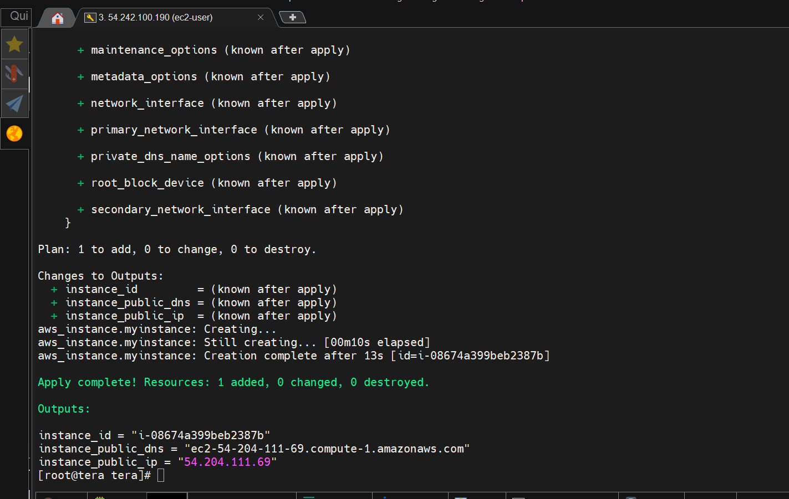
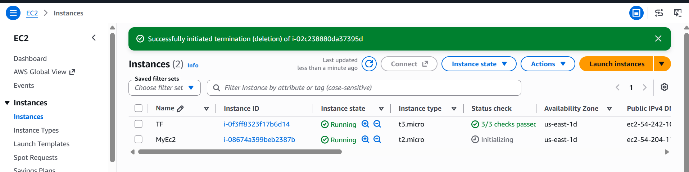
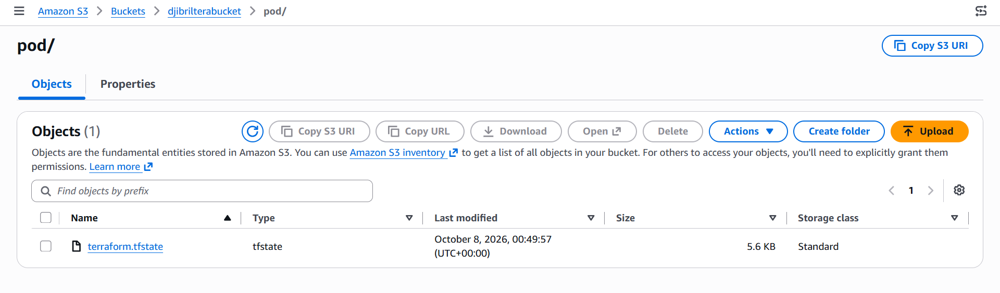

## 📌 Description

Ce projet présente la mise en œuvre d'une infrastructure AWS avec **Terraform**, en utilisant le principe de **Infrastructure as Code (IaC)**.

L'objectif principal est de :

- Provisionner une instance **Amazon EC2** avec Terraform.
- Utiliser **AWS S3** pour stocker le Terraform State à distance.
- Mettre en place le **state locking** afin d'éviter les modifications concurrentes du state.
- Séparer la configuration Terraform en plusieurs fichiers.
- Utiliser des variables Terraform pour rendre l'infrastructure configurable.
- Déployer et gérer l'infrastructure AWS de manière reproductible.

---

# 🏗️ Architecture

L'architecture du projet repose sur Terraform et plusieurs services AWS.

```text
                    ┌──────────────────────┐
                    │      Terraform       │
                    │   Infrastructure     │
                    │       as Code        │
                    └──────────┬───────────┘
                               │
                               │ Provisioning
                               ▼
                    ┌──────────────────────┐
                    │      AWS EC2         │
                    │   Compute Instance   │
                    └──────────────────────┘


Terraform State
      │
      ▼
┌──────────────────────┐
│       Amazon S3      │
│                      │
│ terraform.tfstate    │
└──────────────────────┘
      │
      │ State Locking
      ▼
┌──────────────────────┐
│  S3 Lockfile /       │
│  DynamoDB*           │
└──────────────────────┘

* Selon la configuration du backend utilisée.
```

---

# 📂 Structure du projet

```text
Terraform-fristproject/
│
├── backend.tf
├── main.tf
├── provider.tf
├── variable.tf
├── terraform.tfvars
├── .terraform.lock.hcl
│
├── console.png
├── EC2.png
└── stateFile_on_S3.png
```

### `provider.tf`

Contient la configuration du provider AWS utilisé par Terraform.

Exemple :

```hcl
provider "aws" {
  region = "us-east-1"
}
```

---

### `backend.tf`

Configure le stockage distant du Terraform State.

Exemple avec S3 :

```hcl
terraform {
  backend "s3" {
    bucket       = "djibrilterabucket"
    key          = "pod/terraform.tfstate"
    region       = "us-east-1"
    encrypt      = true
    use_lockfile = true
  }
}
```

Le state Terraform est ainsi stocké dans :

```text
s3://djibrilterabucket/pod/terraform.tfstate
```

---

### `main.tf`

Contient les ressources AWS à créer avec Terraform.

Le projet utilise notamment une instance :

```text
AWS EC2
```

La ressource EC2 permet de démontrer le provisionnement automatique d'une machine virtuelle AWS.

---

### `variable.tf`

Contient les variables utilisées par l'infrastructure.

Exemple :

```hcl
variable "instance_type" {
  description = "EC2 instance type"
  type        = string
}
```

L'utilisation des variables permet d'éviter de coder directement les valeurs dans les ressources Terraform.

---

### `terraform.tfvars`

Contient les valeurs des variables Terraform.

Exemple :

```hcl
instance_type = "t2.micro"
```

> ⚠️ Ne stockez jamais de clés AWS, mots de passe ou secrets directement dans `terraform.tfvars`.

---

# ☁️ AWS Services utilisés

## Amazon EC2

Amazon EC2 fournit l'instance virtuelle créée par Terraform.

L'instance peut être utilisée pour :

- tester le provisioning Terraform ;
- déployer une application ;
- installer des outils DevOps ;
- servir de machine Linux pour des labs Cloud/DevOps.

---

## Amazon S3

Amazon S3 est utilisé pour stocker le **Terraform State** à distance.

Le state contient les informations permettant à Terraform de connaître l'état actuel de l'infrastructure.

Exemple :

```text
S3 Bucket
└── pod/
    └── terraform.tfstate
```

L'utilisation d'un remote backend permet notamment de partager le state entre plusieurs environnements ou collaborateurs.

---

# 🔒 Terraform State Locking

Le verrouillage du state permet d'éviter que plusieurs opérations Terraform modifient simultanément le même state.

Avec les versions récentes du backend S3, Terraform peut utiliser :

```hcl
use_lockfile = true
```

Le mécanisme de verrouillage est alors géré avec S3.

### Ancienne méthode

Terraform utilisait traditionnellement DynamoDB :

```hcl
dynamodb_table = "dynamo_tera"
```

Cette configuration est désormais **dépréciée** pour le backend S3.

Pour une nouvelle configuration, il est recommandé d'utiliser :

```hcl
use_lockfile = true
```

---

# 🔄 Workflow Terraform

Le workflow utilisé dans ce projet est :

```text
          Terraform Configuration
                    │
                    ▼
             terraform init
                    │
                    ▼
             terraform validate
                    │
                    ▼
               terraform plan
                    │
                    ▼
              terraform apply
                    │
                    ▼
              AWS Resources
                    │
                    ▼
            Remote Terraform State
                    │
                    ▼
                 Amazon S3
```

---

# 🚀 Installation

## 1. Installer Terraform

Vérifier l'installation :

```bash
terraform version
```

Exemple :

```text
Terraform v1.x.x
```

---

## 2. Configurer AWS

Terraform doit pouvoir accéder à votre compte AWS.

Vous pouvez utiliser :

- AWS CLI ;
- IAM Role ;
- variables d'environnement ;
- credentials AWS configurés localement.

Vérifier la configuration AWS :

```bash
aws sts get-caller-identity
```

---

# ⚙️ Initialiser Terraform

Depuis le dossier du projet :

```bash
terraform init
```

Terraform télécharge les providers nécessaires et initialise le backend S3.

Si la configuration du backend est modifiée :

```bash
terraform init -reconfigure
```

---

# 🔍 Vérifier la configuration

Utiliser :

```bash
terraform validate
```

Résultat attendu :

```text
Success! The configuration is valid.
```

---

# 📋 Formater le code

Pour respecter le format standard Terraform :

```bash
terraform fmt
```

Pour vérifier les fichiers sans les modifier :

```bash
terraform fmt -check
```

---

# 📊 Prévisualiser les changements

Avant de créer les ressources :

```bash
terraform plan
```

Terraform affiche les ressources qui seront :

- créées ;
- modifiées ;
- supprimées.

---

# 🚀 Déployer l'infrastructure

Pour créer les ressources AWS :

```bash
terraform apply
```

Terraform demandera une confirmation.

Pour appliquer automatiquement :

```bash
terraform apply -auto-approve
```

---

# 📤 Afficher les outputs

Après le déploiement :

```bash
terraform output
```

Pour afficher une valeur spécifique :

```bash
terraform output ec2_public_ip
```

---

# 🗑️ Détruire l'infrastructure

Pour supprimer les ressources créées par Terraform :

```bash
terraform destroy
```

Ou :

```bash
terraform destroy -auto-approve
```

> ⚠️ Attention : cette commande peut supprimer définitivement les ressources AWS créées par Terraform.

---

# 📸 Captures du projet

## Console AWS

La capture `console.png` présente la console AWS utilisée pendant le déploiement.



---

## Instance EC2

La capture `EC2.png` montre l'instance EC2 provisionnée avec Terraform.



---

## Terraform State dans S3

La capture `stateFile_on_S3.png` montre le Terraform State stocké dans le bucket Amazon S3.



---

# 🔐 Bonnes pratiques

## Ne jamais versionner les credentials AWS

Ne mettez jamais dans Git :

```text
AWS Access Key
AWS Secret Key
AWS Session Token
Passwords
Private Keys
```

Utilisez plutôt :

```bash
aws configure
```

ou un IAM Role.

---

## `.terraform.lock.hcl`

Le fichier :

```text
.terraform.lock.hcl
```

doit être conservé dans Git.

Il permet à Terraform de conserver les versions des providers sélectionnés.

---

## `.gitignore`

Il est recommandé d'ajouter :

```gitignore
.terraform/
*.tfstate
*.tfstate.*
crash.log
*.tfvars
!example.tfvars
```

> Le `.tfstate` ne doit généralement pas être versionné lorsqu'un backend distant S3 est utilisé.

---

# 🧪 Commandes principales

| Commande | Description |
|---|---|
| `terraform init` | Initialise Terraform |
| `terraform init -reconfigure` | Réinitialise le backend |
| `terraform validate` | Vérifie la configuration |
| `terraform fmt` | Formate les fichiers Terraform |
| `terraform plan` | Prévisualise les changements |
| `terraform apply` | Crée/modifie l'infrastructure |
| `terraform output` | Affiche les outputs |
| `terraform show` | Affiche l'état courant |
| `terraform state list` | Liste les ressources du state |
| `terraform destroy` | Supprime l'infrastructure |

---

# 🎯 Objectifs pédagogiques

Ce projet permet de pratiquer les concepts suivants :

- Infrastructure as Code (**IaC**)
- Terraform
- AWS Provider
- Amazon EC2
- Amazon S3
- Terraform Remote Backend
- Terraform State
- State Locking
- Variables Terraform
- Terraform Outputs
- `terraform init`
- `terraform validate`
- `terraform plan`
- `terraform apply`
- `terraform destroy`

---

# 📈 Évolutions possibles

Ce projet peut être amélioré progressivement avec :

- [ ] Création automatique du VPC
- [ ] Subnets publics et privés
- [ ] Internet Gateway
- [ ] Route Tables
- [ ] Security Groups
- [ ] Application Load Balancer
- [ ] Auto Scaling Group
- [ ] IAM Roles
- [ ] CloudWatch
- [ ] Terraform Modules
- [ ] Environnements `dev`, `staging` et `prod`
- [ ] CI/CD avec Jenkins ou GitHub Actions
- [ ] Intégration avec Kubernetes
- [ ] Infrastructure AWS complète avec Terraform

---

# 👨‍💻 Auteur

**Boubacar Djibrilla**

Ingénieur Génie Logiciel | AWS | DevOps | Cloud

### Domaines

- AWS
- Terraform
- Linux
- Docker
- Kubernetes
- Jenkins
- Ansible
- CI/CD
- Cloud & DevOps

---

# ⭐ Conclusion

Ce projet constitue une première mise en pratique de **Terraform sur AWS**, avec un focus particulier sur la gestion du **Terraform State à distance avec Amazon S3** et le **state locking**.

Il constitue une base pour évoluer vers des architectures AWS plus complexes et des pipelines **CI/CD et DevOps entièrement automatisés**.
